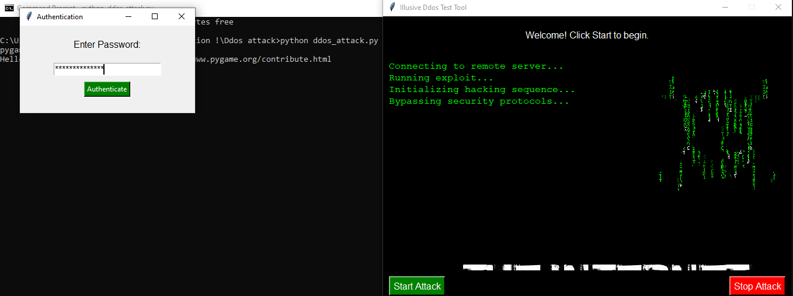

# Ddos-v1

# Illusive Ddos Tool - For Educational Use Only

Welcome to the **Illusive Ddos Tool**, an advanced DDoS stress testing tool created for educational purposes. This tool is designed to simulate stress testing scenarios and is not intended for malicious use. Please ensure you have authorization before testing any target websites.

## Table of Contents

1. [Description](#description)
2. [Features](#features)
3. [Installation](#installation)
4. [Usage](#usage)
5. [Screenshots](#screenshots)
6. [License](#license)

## Description

The **Illusive Ddos Tool** is a stress testing tool built with **Python** and **Tkinter** for the GUI. It allows users to initiate a simulated DDoS attack against a designated target server. The tool uses **requests** for flooding the target server with requests, with customizable configurations like user agents, thread counts, and more. It includes a beautiful GUI with animations and sound effects.

> **Note:** This tool is for educational purposes only. Unauthorized use may result in legal consequences.

## Features

- **DDoS Simulation**: Simulate a Distributed Denial of Service attack.
- **Thread-based Requests**: Use multiple threads for a high volume of requests.
- **User Authentication**: Protect the tool with a password to prevent unauthorized access.
- **Interactive GUI**: User-friendly interface built with Tkinter, featuring dynamic code scroll animation.
- **Sound Effects**: Sound effects for a more immersive experience.
- **GIF Animation**: Display a GIF animation during the test.

## Installation

1. Clone the repository:

   ```bash
   git clone https://github.com/Illusivehacks/Ddos-v1.git
   cd Illusive-Ddos-Tool
2. Install the required dependencies:

bash
````pip install -r requirements.txt````

Make sure you have Python 3.7+ installed.
3. Usage
To start the DDoS simulation, simply run the main.py script:

bash
````python ddos_attack.py````

You will be prompted to enter the authentication password. After successful authentication, the tool will start sending requests to the target URL.

Start the Attack
Click the "Start Attack" button to begin the DDoS simulation.

Stop the Attack
Click the "Stop Attack" button to stop the ongoing simulation.

Screenshots

Below are some screenshots of the tool in action:





License


This project is for educational use only. Please ensure that you have proper authorization before using this tool.
MIT License - Free to use and modify.
Made with love by IllusiveHacks ❤️

````Let me know if you'd like to adjust any part of this!````


